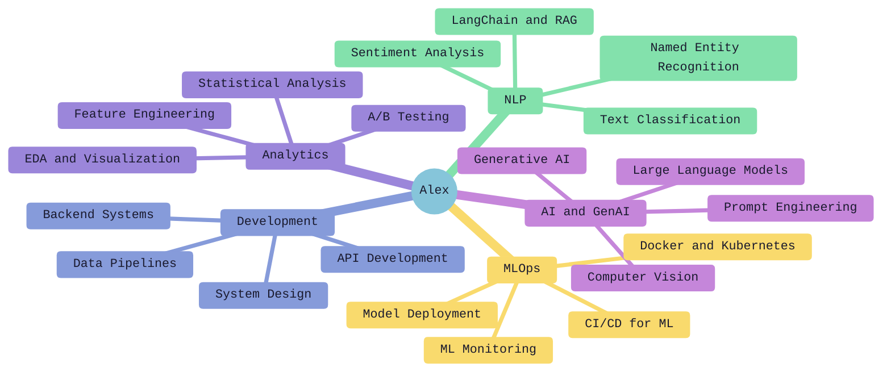

<!-- Animated Space Banner -->

  

 

<!-- Dynamic Name & Roles -->

  <h1 align="center">✦ Alex Kochu ✦</h1>
  

 

<!-- Mission Bio -->

  

 

<!-- Connect Comm Links -->

   
   
  

 

  

 

<h2 align="center">🚀 TECH ARSENAL 🚀</h2>

<table align="center" width="100%" style="border-collapse: collapse;">
  <tr>
    <td width="50%" valign="top">
      <h3 align="center">🧠 Machine Learning</h3>
      

         
         
         
         
         
         
        
      

    </td>
    <td width="50%" valign="top">
      <h3 align="center">💻 Languages</h3>
      

         
         
         
        
      

    </td>
  </tr>
  <tr>
    <td width="50%" valign="top">
      <h3 align="center">☁️ Cloud & Infra</h3>
      

         
         
         
         
         
        
      

    </td>
    <td width="50%" valign="top">
      <h3 align="center">🛢️ Databases & APIs</h3>
      

         
         
         
         
         
        
      

    </td>
  </tr>
</table>

 

  

 

<h2 align="center">🌌 ACHIEVEMENTS & MISSIONS 🌌</h2>

<table align="center" width="100%">
  <tr align="center">
    <td width="33%">
       
      <i style="color: #9CA3AF;">Three-time certified professional</i>
    </td>
    <td width="33%">
       
      <i style="color: #9CA3AF;">People & operations expertise</i>
    </td>
    <td width="33%">
       
      <i style="color: #9CA3AF;">ML model deployment & insights</i>
    </td>
  </tr>
</table>

 

  

 

<h2 align="center">🛸 MISSION CONTROL LOGS 🛸</h2>

  

 

<table align="center" width="100%">
  <tr>
    <td align="center" width="50%">
      
    </td>
    <td align="center" width="50%">
       
    </td>
  </tr>
</table>

 

  

 

<h2 align="center">🎯 CURRENT FOCUS 🎯</h2>

 

  

 

  
<i>"Houston, we have an insight."</i>

  

